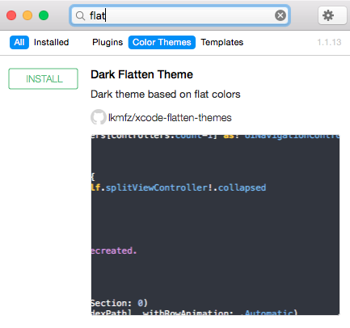
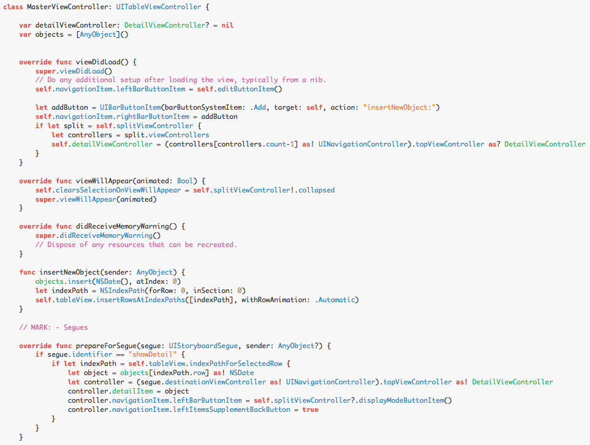

# xcode-flatten-themes
🎨 Xcode themes based on flat colors

## Installation

### Alcatraz

You can search and install these themes using [Alcatraz](http://alcatraz.io/)

>[Alcatraz](http://alcatraz.io/) is an open-source package manager for Xcode. It lets you discover and install plugins, templates, and color schemes without the need for manually cloning or copying files.

<h3 align="center">
   <kbd></kbd>
</h3>

### Manually
- Clone/download this repo

- Open terminal and place your current directory on downloaded folder directory

- Copy '.dvtcolortheme' file(s) into Xcode directory:

        cp FlattenDark.dvtcolortheme ~/Library/Developer/Xcode/UserData/FontAndColorThemes
        cp FlattenLight.dvtcolortheme ~/Library/Developer/Xcode/UserData/FontAndColorThemes

## Screenshots

### Dark ⚫️
<h3 align="center">
   <kbd></kbd>
</h3>
### Light ⚪️
<h3 align="center">
   <kbd></kbd>
</h3>
